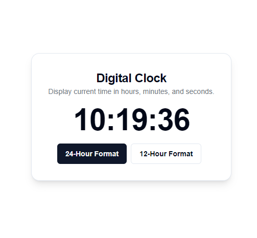
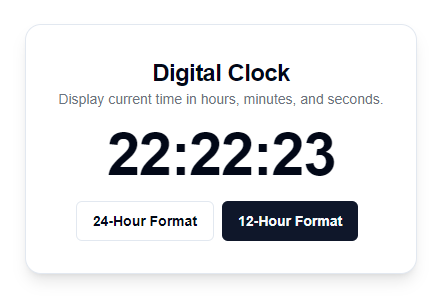

# Digital Clock

This project is a simple **Digital Clock** component built using **React** and **TypeScript**. The clock displays the current time and allows the user to switch between 24-hour and 12-hour formats. The clock updates every second in real-time using `setInterval` inside a `useEffect` hook.

## Features

- **Real-time Clock**: The time is updated every second.
- **24-Hour / 12-Hour Format Switch**: Users can toggle between 24-hour and 12-hour formats using buttons.
- **Responsive UI**: The clock is centered on the screen, and the layout adapts to various screen sizes.

## Project Structure

- **React Functional Component**: Built using a functional component with `useState`, `useEffect`, and `useMemo` hooks.
- **UI Components**: 
  - **Card**: A UI card component that contains the clock.
  - **Button**: Two buttons allow toggling between time formats.

## Code Overview

### State Variables
- `time`: Stores the current time (`Date` object) and is updated every second.
- `is24Hour`: Boolean to switch between 24-hour and 12-hour formats.
- `mounted`: Tracks whether the component has been mounted to prevent initial render issues.

### Key Hooks
- **`useState`**: Manages the component state for time, time format, and mounted status.
- **`useEffect`**: Sets up a timer with `setInterval` that updates the time every second.
- **`useMemo`**: Memoizes the formatted time to avoid recalculating it on every render.

### Time Formatting
The `formattedTime` variable is derived using `useMemo` and formats the hours, minutes, and seconds based on the chosen time format (12-hour or 24-hour).

## Customization

- **Change the UI**: Modify the styles of the `Card` and `Button` components to suit your design preferences.
- **Add more features**: You can enhance the clock by adding features like date display, timezone support, or custom themes.

## Screenshots

### Digital Clock in 24-Hour Format:

### Digital Clock in 12-Hour Format:

## Technologies Used

- **React**: A JavaScript library for building user interfaces.
- **TypeScript**: A typed superset of JavaScript.
- **Tailwind CSS (optional)**: For styling the UI components.
- **Vercel**: You can deploy this project easily on Vercel.

## Deployment
[Live Demo 🔗](https://digital-clock-app-two.vercel.app)
